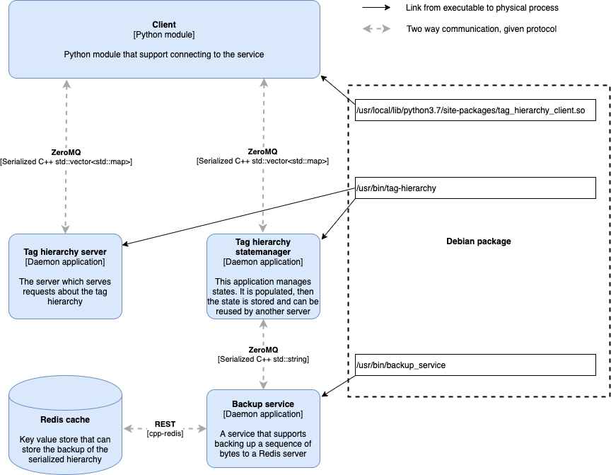

# ioc-hierarchy-service
In-memory queryable hierarchy service

This project generates a debian package with all components necessary to
create an in-memory cache of a hierarchy. The hierarchy is modelled as
a graph and can be queried in a number of ways. The cache itself is run
as a daemon process which can be backed up by using another daemon
process called backup service. All interprocess communication is handled
with ZeroMQ.

Querying the process must be done using the bundled python module. This
can be imported and a function named `query` can be run, e.g. to check
the health of the service:

```
>>> import tag_hierarchy_client
>>> tag_hierarchy_client.query([{'command': 'healthcheck'}], "server")
```

# Architectural overview
The following diagram describes which components are bundled with the
debian package and how they are intended to be used:



## Communication
Components communicate via ZeroMQ(ZMQ). We use the patterns REQ-REP
(request-response) when the python client communicates with the server
or the statemanager.

To communicate with the process from python, the `query` function must be
used. The `query` function takes a list of dictionaries as input
and returns a list of dictionaries. By convention the first
dictionary of a request constitutes the command. Any number of
subsequent dictionaries constitute the data associated with the command.

The python client module is built in C++ using the package `pybind11`, which
translates the python dictionaries into C++ native `std::map`. Since
C++ is statically typed, only a subset of dictionary key and value
types are permitted, and this is supported on the C++ by using
`boost::variant`. Currently the supported dictionary type is
`Dict[str, Union[bool, int, float, none, str, List[int], List[str]]]]`
Trying to pass objects that do not conform will raise a `TypeError`

## Tag hierarchy service
The tag hierarchy service keeps a tag hierarchy in memory. To populate
the tag hierarchy, use the `populate_hierarchy` command. To query the
hierarchy, the `nodes` command is used.

### Flow
Populating the hierarchy can take quite a bit of time, therefore the
package supports running in a statemanager mode which should not be used
for other purposes than managing the state of the hierarchy.

When the cache is updated, the population process happens against the
statemanager while the server is still serving requests. When the
population is done, it is asked to store itself via the backup service.
When the backup service has stored a new state, it notifies the server
via ZMQ PUB-SUB which the server will react to and it will get the
newest state from the backup service and initialize itself with that.
Finally the statemanager can clear its state so it does not consume
memory while idle.

## Backup service

### Storing the state
The backup service is a REQ-REP service. When it gets a message it will
try to store that message in redis under the key "hierarchy_cache" and
return `"Success"`. It will also PUBlish a message `"cache_updated"`
which the server should SUBscribe to and react to by retrieving the
latest state. 

### Retrieving the state
If the message sent to the backup service is `"GET_HIERARCHY"` it will
return a message with the serialized state, which the server can use to
re-initialize itself with the latest state.

## Dependencies
The project uses a number of third party dependencies:

### Boost
Boost is almost an extension of the C++ standard library, and we use
a few features from it
* Boost graph library - Used to model the hierarchy as a graph data
structure. Provides the central algorithm used for tree traversal
* Boost variant - Used to provide type safe unions that help us manage
dictionaries with different types coming from Python
* Boost serialization -  Used to serialize the graph for backups
* Boost iostreams - Used for compression the serialized graph
* Boost test - Used for unit testing

When developing in the docker container, boost is installed using the
system package manager. For development on mac, boost can be installed
using homebrew.

### Other libraries
The project has a few other dependencies
* ZeroMQ - This library handles the interprocess communication between
the python client and the servers
* cppzmq - Provides c++ bindings to libzmq
* cpp_redis - Provides functionality for storing strings in Redis cache
* opencensus_cpp - Provides logging functionality
* pybind11 - Seamless integration of call interfaces between Python
and C++

All libraries are kept vanilla, no upstream changes have been made, and
we hope to keep it that way. Libraries should be updated when security
concerns are discovered, or when new functionality or substantial
performance fixes are made.

When new major versions are released, upgrades should be considered to
avoid accumulating technical debt. If any of the libraries go through
significant API changes in the future, consider writing a wrapper
between the application and the library to mitigate future risks of
rewriting.

# Development
## Build system
The project is built using cmake. On Mac/Unix platforms it can be done in
the following way (using 12 threads for building):
```
git clone https://github.com/equinor/ioc-hierarchy-service.git
mkdir build-ioc-hierarchy-service
cd build-ioc-hierarchy-service
cmake ../ioc-hierarchy-service
make -j12
```

## Unit tests
To run the unit tests, stay in the build folder and run
```
ctest
```

### Unit test data
The unit test data is dumped from the API application that usually drives
this service. It can be generated by running the test named `DumpDb` in the
API. This creates a cpp file called `hierarchy_dump.cpp` that is actual cpp
code to create the objects necessary to populate the hierarchy service with
a dummy hierarchy used for testing purposes.

Further, to avoid long compilation times, the test data is available in serialized
form. To recreate the file called `serialized_hierarchy.dat`
from an updated `hierarchy_dump.cpp`, stay in the build folder and run
```
make create_test_data
tag_hierarchy/create_test_data
```
and copy the resulting `serialized_hierarchy.dat` to `tag_hierarchy/unittests`


## Getting started running CLion with Docker
Preconditions: Docker and CLion must be installed on your local computer

Follow instructions from step 3 onwards in the [stackoverflow article](https://stackoverflow.com/questions/55272484/how-to-code-run-programs-in-a-docker-container-using-clion/55424792) 
to configure clion. (The Dockerfile and docker-compose.yml mentioned
in the article are already in git.) Note however, if something goes wrong in step 3a, rebuild is not available from
the CLion. Commandline is necessary for doing docker-compose build to rebuild. If on windows running _Docker desktop_, you 
might have to go to Docker desktop settings and _expose localhost without TLS_.

## Developing outside Docker
To develop on a mac, use homebrew to install boost (google for latest
instructions). You can use clion which supports CMake projects out of
the box, or any other IDE which supports CMake. Windows development has
been attempted, but challenges building the ZeroMQ library stopped the
effort.

